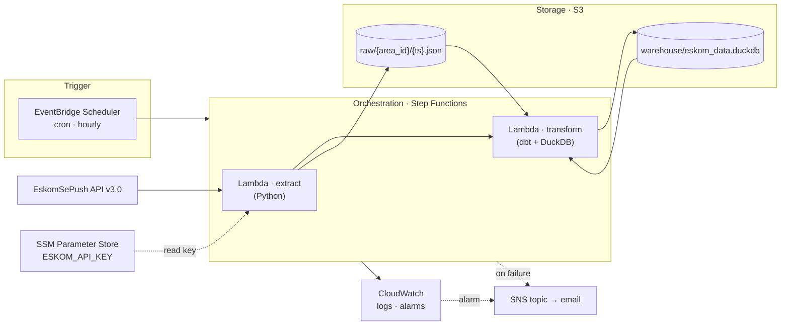
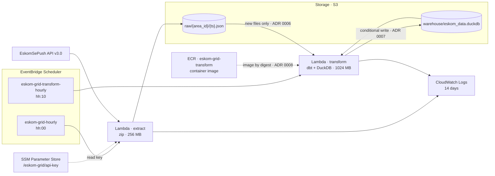
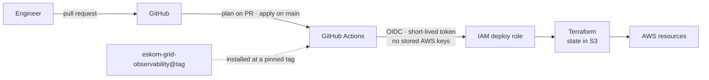

# Eskom Grid Cloud

Serverless, zero-cost AWS deployment of the [Eskom Grid Observability](https://github.com/Furnx/eskom-grid-observability) pipeline — infrastructure as code, deployed by CI, running around the clock without a laptop.

> **Status:** Phase 2 complete (2026-09-26): raw JSON lands in S3 on the hour, and ten minutes later a second Lambda runs the dbt models over the new files and updates the DuckDB warehouse in S3 — both without the laptop. Phase 1 (2026-09-24) also proved a full destroy → rebuild → restore. Phase 3 (orchestration and alerting) is next. Details in [docs/ROADMAP.md](docs/ROADMAP.md).

## The problem

[Eskom Grid Observability](https://github.com/Furnx/eskom-grid-observability) is a batch ELT pipeline: every hour it pulls loadshedding schedules for South African metros from the EskomSePush API, lands the raw JSON, and builds a dimensional model with dbt on DuckDB. Its value is the **history it accumulates** — and the local deployment only runs while a laptop is switched on.

| Weakness of the local deployment | Consequence |
|---|---|
| Runs inside Docker Desktop on a laptop | Every hour the laptop is off is a gap in the history |
| Raw landing zone and warehouse live on one disk, git-ignored | One disk failure erases everything collected |
| The API key lives in a `.env` file | A secret tied to a machine, not to an identity |
| Nothing watches the pipeline | Failures go unnoticed until someone looks |
| "The infrastructure" is a laptop | It cannot be rebuilt from code |

## The solution

Move the workload — its logic unchanged — onto managed, event-driven AWS services, provisioned entirely by Terraform, deployed by GitHub Actions, and kept inside the AWS Free Plan.

| Local component | Role | AWS replacement |
|---|---|---|
| Dagster `ScheduleDefinition` (cron) | Trigger | EventBridge Scheduler |
| Dagster job (extract → dbt build) | Orchestration | Step Functions |
| Docker container running the `@asset` code | Compute | Lambda |
| `data/raw/{area_id}/{ts}.json` | Raw landing zone | S3 |
| `data/eskom_data.duckdb` | Warehouse | DuckDB file in S3 |
| `.env` | Secrets | SSM Parameter Store |
| `context.log` + Dagster UI | Logs and alerts | CloudWatch + SNS |
| Docker Desktop | Infrastructure | Terraform |
| `docker compose up` | Deployment | GitHub Actions via OIDC |

Dagster remains the *local development* orchestrator. In production its job is done by the cloud's own scheduler and state machine — the reasoning is in [ADR 0002](docs/adr/0002-dagster-stays-local.md).

## Target architecture



Running today (end of Phase 2). Until Phase 3's state machine, two schedules
stand in for it, ten minutes apart, and nothing alerts on failure yet:



Delivery path (Phase 4):



Every workload identity is least-privilege: the extract function may only read one parameter and write into `raw/`; the transform function may read `raw/` and read/write `warehouse/`, nothing else.

## How the two repositories relate

- **[eskom-grid-observability](https://github.com/Furnx/eskom-grid-observability)** — the *application*: extraction logic, dbt models and tests, and the Dagster definitions used for local development.
- **eskom-grid-cloud** (this repository) — the *platform*: Terraform, Lambda entry points, CI/CD, monitoring, and the decisions behind them.

The platform installs the application at a **pinned git tag**, so every deployment is versioned and the two repositories evolve independently. No pipeline logic lives here.

## Cost

Designed for **R0**. The account is on the AWS Free Plan (credits, cannot be charged) and the design uses only services with always-free allowances wherever one exists — see [ADR 0003](docs/adr/0003-zero-cost-constraints.md).

Hourly cadence, two areas. Lambda and ECR figures are measured from the first
days of Phase 2 (2026-09-26): an extract run bills about 0.8 GB-s, a transform
run about 12 GB-s (1 GB for ~11–12 s, peaking near 400 MB). The rest are
estimates, and the Phase 3 rows are not running yet; Phase 5 replaces them with
a month of measured usage. Prices are af-south-1's, from the AWS Price List API.

| Service | Monthly usage | Always-free allowance | Note |
|---|---|---|---|
| Lambda | 1,440 invocations · ~9,000 GB-s (measured) | 1M invocations · 400,000 GB-s | always free · ~2% of the compute allowance |
| Step Functions (Standard) · *Phase 3* | ~2,200 state transitions | 4,000 | always free — state machine kept to ≤ 5 states |
| EventBridge Scheduler | 1,440 invocations (two schedules) | 14M | always free |
| SSM Parameter Store | 1 standard parameter | standard parameters free | always free |
| SNS · *Phase 3* | < 10 emails | 1,000 emails | always free |
| CloudWatch | < 100 MB logs | 5 GB logs · 10 alarms | always free |
| S3 | ~0.2 GB (mostly 3 days of old warehouse versions) · ~2,900 PUT/LIST · ~6,500 GET | none on the Free Plan | ≈ $0.03 — credits |
| ECR | 3 images × ~265 MB ≈ 0.8 GB (measured) | none on the Free Plan | ≈ $0.08 ($0.10/GB-month) — credits |

Estimated steady state on a paid plan after the Free Plan window (~March 2027): **about $0.10 per month**, almost all of it ECR storage and S3 requests.

## Deploy / destroy

Prerequisites: AWS CLI v2 with the `eskom-admin` profile, Terraform >= 1.6,
Python 3.13 with `pip`, Docker Desktop (the transform image is built locally
for arm64), and an EskomSePush API key.

### One-time: store the API key

The key is kept in SSM Parameter Store and is deliberately **not** managed by
Terraform, so its value never enters the configuration or the state file.
Create it once:

```powershell
aws ssm put-parameter `
  --name "/eskom-grid/api-key" `
  --type SecureString `
  --value "<your EskomSePush key>" `
  --profile eskom-admin --region af-south-1
```

`terraform destroy` does not remove it, so this step is not repeated.

### Deploy

```powershell
# 0. First deployment only: the transform's image needs a repository before it
#    can be pushed, and the function needs the image. Create the repository
#    alone first. The quotes matter in PowerShell, which otherwise splits the
#    argument at the dot.
cd infra
terraform init
terraform apply "-target=aws_ecr_repository.transform"
cd ..

# 1. Build the extract Lambda package from the pinned application tag
#    (app_version in infra/variables.tf). archive_file is read at plan time,
#    so this must come first; the plan also refuses a build made from a
#    different version.
./scripts/build_lambda.ps1

# 2. Build, smoke-test and push the transform image (ADR 0008). The smoke tests
#    run a real dbt build offline, on a read-only disk, without /dev/shm, as in
#    Lambda. Only committed code is pushed; the pushed tag is recorded in
#    build/ for the plan, which deploys it by digest. About 2 minutes from
#    Docker's cache, 10-15 after an application change.
./scripts/build_transform_image.ps1 -Push

# 3. Review and apply. Avoid the minute either schedule fires (hh:00, hh:10):
#    a run that starts mid-deploy gets the old code.
cd infra
terraform plan      # read this before applying
terraform apply
```

`terraform apply` prints the bucket, both functions, their log groups and
schedules, the ECR repository and a set of copy-paste verification commands.

### Verify

```powershell
# Invoke once (costs 2 of the 50 daily EskomSePush requests)
aws lambda invoke --function-name eskom-grid-extract `
  --profile eskom-admin --region af-south-1 response.json; cat response.json

# One object per area, all sharing a run timestamp
aws s3 ls s3://eskom-grid-<account-id>/raw/ --recursive --profile eskom-admin

# Logs
aws logs tail /aws/lambda/eskom-grid-extract --since 15m `
  --profile eskom-admin --region af-south-1

# Run the transform once (no API cost). Without --cli-read-timeout the CLI
# gives up after 60 s and invokes the function a second time.
aws lambda invoke --function-name eskom-grid-transform --cli-read-timeout 310 `
  --profile eskom-admin --region af-south-1 response.json; cat response.json

# The warehouse it replaced, and its logs
aws s3api head-object --bucket eskom-grid-<account-id> --key warehouse/eskom_data.duckdb `
  --profile eskom-admin --region af-south-1
aws logs tail /aws/lambda/eskom-grid-transform --since 15m `
  --profile eskom-admin --region af-south-1
```

### Look at the warehouse

The warehouse is a single DuckDB file in S3. To query it, the script below
downloads the current version into a temporary folder, opens it read-only in
the DuckDB command-line tool (`winget install DuckDB.cli`), and deletes the
copy when you quit. It never uploads: the transform function owns that object.

```powershell
# Explore interactively: SQL ending in ';', .tables to list tables, .quit to leave
./scripts/look_at_warehouse.ps1

# Or ask one question and exit (text values in single quotes)
./scripts/look_at_warehouse.ps1 -Query "SELECT count(*) AS runs FROM fct_pipeline_runs"

# Keep the copy, e.g. to practise offline
./scripts/look_at_warehouse.ps1 -KeepCopyIn "$HOME\eskom-grid-practice"
```

`fct_pipeline_runs` has one row per extraction run (a new row every hour);
times are stored in UTC, so add `INTERVAL 2 HOUR` for SAST.

### Destroy

`terraform destroy` removes infrastructure, never history
([ADR 0005](docs/adr/0005-raw-history-outlives-infrastructure.md)). The raw
bucket holds the only copy of data the API cannot return again, so S3's refusal
to delete a bucket that still holds data is kept as a safety catch.

**A plain `terraform destroy`** removes the schedules, functions, roles, log
groups and the ECR repository *with its images* (they are rebuilt from git,
[ADR 0008](docs/adr/0008-transform-image-deployed-by-digest.md)), then stops
with `BucketNotEmpty`. The history is intact, but the bucket
has lost its public access block, lifecycle rule and versioning;
`terraform apply` restores them along with everything else.

**A full teardown, history included**, is two deliberate steps. Start just
after a scheduled run (around hh:02), so that no new object lands between them:

```powershell
# 1. Back up, verify, then delete every object version. The script downloads
#    the bucket into -BackupPath (a new folder, outside the repository), checks
#    every file against S3's MD5 fingerprint, and only then asks for the bucket
#    name. The bucket is versioned, so `aws s3 rm` would only add delete markers.
#    Add -DryRun to do everything except the deletion.
./scripts/purge_bucket.ps1 -Bucket eskom-grid-<account-id> -BackupPath "$HOME\eskom-grid-backup\<date>"

# 2. Remove the infrastructure.
cd infra
terraform destroy
```

Left in place on purpose: the SSM parameter holding the API key (created
outside Terraform) and your local backup.

### Rebuild and restore

```powershell
# The same order as a first deployment: repository, image, everything else.
cd infra
terraform apply "-target=aws_ecr_repository.transform"
cd ..
./scripts/build_lambda.ps1
./scripts/build_transform_image.ps1 -Push
cd infra
terraform apply
cd ..

$backup = "$HOME\eskom-grid-backup\<date>"
aws s3 sync "$backup\objects" s3://eskom-grid-<account-id>/ --profile eskom-admin

# Prove the restore is byte-identical: no output means every object matches.
aws s3api list-objects-v2 --bucket eskom-grid-<account-id> --query "Contents[].[Key, ETag, Size]" `
  --output text --profile eskom-admin | Sort-Object | Set-Content "$backup\restored.tsv"
Compare-Object (Get-Content "$backup\fingerprints.tsv") (Get-Content "$backup\restored.tsv")
```

If `apply` fails on the bucket with `OperationAborted`, S3 has not yet released
the name of the bucket that was just deleted: wait a few minutes and run
`terraform apply` again. Restored objects keep their keys, and the run
timestamp is part of the key, so the history continues where it stopped. A
scheduled run that lands before the comparison shows up as extra `=>` lines.
The backup includes the warehouse, so the transform carries on from it; a
transform run that fires before the restore is harmless, because the warehouse
is derived entirely from `raw/`.

### API quota

The EskomSePush free tier allows 50 requests per day. This deployment uses one
request per area per run: two areas, hourly, is 48 per day. **Keep the local
Dagster schedule switched off while the cloud deployment is running** - both
together would exceed the quota and the extraction would start failing with
HTTP 429.

## Decisions

Architecture Decision Records live in [docs/adr/](docs/adr/README.md). Start with [0001](docs/adr/0001-serverless-over-always-on-vm.md) (why serverless), [0002](docs/adr/0002-dagster-stays-local.md) (why Dagster stays local) and [0003](docs/adr/0003-zero-cost-constraints.md) (the zero-cost rules).

## Repository layout

Planned; directories appear in the phase that fills them.

```
eskom-grid-cloud/
├── README.md
├── CLAUDE.md                 project context for AI-assisted sessions
├── docs/
│   ├── ROADMAP.md            phases, milestones, status
│   └── adr/                  architecture decision records
├── infra/                    Terraform — one file per concern        (Phase 1–2)
├── functions/                thin Lambda entry points:               (Phase 1–2)
│   ├── extract/              handler.py, shipped as a zip
│   └── transform/            handler.py + Dockerfile, shipped as an image
├── .github/workflows/        plan on PR, apply on main               (Phase 4)
└── scripts/                  build (zip, image + push), purge, look at the warehouse; smoke test (Phase 1–2, 5)
```
WTC-PQ6WCN86