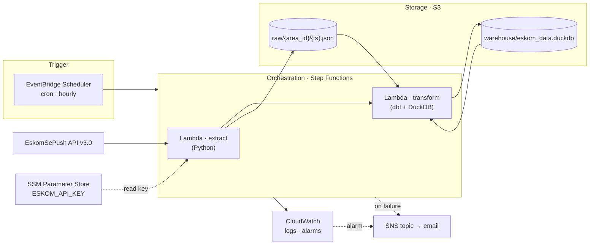
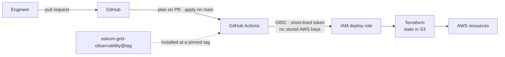

# Eskom Grid Cloud

Serverless, zero-cost AWS deployment of the [Eskom Grid Observability](https://github.com/Furnx/eskom-grid-observability) pipeline — infrastructure as code, deployed by CI, running around the clock without a laptop.

> **Status:** Phase 0 complete (account secured, 2026-09-21). Phase 1 in progress. Details in [docs/ROADMAP.md](docs/ROADMAP.md).

## The problem

[Eskom Grid Observability](https://github.com/Furnx/eskom-grid-observability) is a batch ELT pipeline: every hour it pulls loadshedding schedules for South African metros from the EskomSePush API, lands the raw JSON, and builds a dimensional model with dbt on DuckDB. Its value is the **history it accumulates** — and the local deployment only runs while a laptop is switched on.

| Weakness of the local deployment | Consequence |
|---|---|
| Runs inside Docker Desktop on a laptop | Every hour the laptop is off is a gap in the history |
| Raw landing zone and warehouse live on one disk, git-ignored | One disk failure erases everything collected |
| The API key lives in a `.env` file | A secret tied to a machine, not to an identity |
| Nothing watches the pipeline | Failures go unnoticed until someone looks |
| "The infrastructure" is a laptop | It cannot be rebuilt from code |

## The solution

Move the workload — its logic unchanged — onto managed, event-driven AWS services, provisioned entirely by Terraform, deployed by GitHub Actions, and kept inside the AWS Free Plan.

| Local component | Role | AWS replacement |
|---|---|---|
| Dagster `ScheduleDefinition` (cron) | Trigger | EventBridge Scheduler |
| Dagster job (extract → dbt build) | Orchestration | Step Functions |
| Docker container running the `@asset` code | Compute | Lambda |
| `data/raw/{area_id}/{ts}.json` | Raw landing zone | S3 |
| `data/eskom_data.duckdb` | Warehouse | DuckDB file in S3 |
| `.env` | Secrets | SSM Parameter Store |
| `context.log` + Dagster UI | Logs and alerts | CloudWatch + SNS |
| Docker Desktop | Infrastructure | Terraform |
| `docker compose up` | Deployment | GitHub Actions via OIDC |

Dagster remains the *local development* orchestrator. In production its job is done by the cloud's own scheduler and state machine — the reasoning is in [ADR 0002](docs/adr/0002-dagster-stays-local.md).

## Target architecture



Delivery path (Phase 4):



Every workload identity is least-privilege: the extract function may only read one parameter and write into `raw/`; the transform function may read `raw/` and read/write `warehouse/`, nothing else.

## How the two repositories relate

- **[eskom-grid-observability](https://github.com/Furnx/eskom-grid-observability)** — the *application*: extraction logic, dbt models and tests, and the Dagster definitions used for local development.
- **eskom-grid-cloud** (this repository) — the *platform*: Terraform, Lambda entry points, CI/CD, monitoring, and the decisions behind them.

The platform installs the application at a **pinned git tag**, so every deployment is versioned and the two repositories evolve independently. No pipeline logic lives here.

## Cost

Designed for **R0**. The account is on the AWS Free Plan (credits, cannot be charged) and the design uses only services with always-free allowances wherever one exists — see [ADR 0003](docs/adr/0003-zero-cost-constraints.md).

Estimates at hourly cadence for two areas; to be replaced with measured usage in Phase 5. Verify allowances against the AWS pricing pages before relying on them.

| Service | Monthly usage (estimate) | Always-free allowance | Note |
|---|---|---|---|
| Lambda | ~1,440 invocations · ~25,000 GB-s | 1M invocations · 400,000 GB-s | always free |
| Step Functions (Standard) | ~2,200 state transitions | 4,000 | always free — state machine kept to ≤ 5 states |
| EventBridge Scheduler | 720 invocations | 14M | always free |
| SSM Parameter Store | 1 standard parameter | standard parameters free | always free |
| SNS | < 10 emails | 1,000 emails | always free |
| CloudWatch | < 100 MB logs · 2 alarms | 5 GB logs · 10 alarms | always free |
| S3 | ~5 MB · ~3,000 requests | none on the Free Plan | ≈ $0.01 — credits |
| ECR | 1 image ≤ 500 MB | none on the Free Plan | ≈ $0.05 — credits |

Estimated steady state on a paid plan after the Free Plan window (~March 2027): **under $0.10 per month**.

## Deploy / destroy

Prerequisites: AWS CLI v2 with the `eskom-admin` profile, Terraform >= 1.6,
Python 3.13 with `pip`, and an EskomSePush API key.

### One-time: store the API key

The key is kept in SSM Parameter Store and is deliberately **not** managed by
Terraform, so its value never enters the configuration or the state file.
Create it once:

```powershell
aws ssm put-parameter `
  --name "/eskom-grid/api-key" `
  --type SecureString `
  --value "<your EskomSePush key>" `
  --profile eskom-admin --region af-south-1
```

`terraform destroy` does not remove it, so this step is not repeated.

### Deploy

```powershell
# 1. Build the Lambda package from the pinned application tag (app_version
#    in infra/variables.tf). archive_file is read at plan time, so this must
#    come first; the plan also refuses a build made from a different version.
./scripts/build_lambda.ps1

# 2. Review and apply.
cd infra
terraform init      # first time only
terraform plan      # read this before applying
terraform apply
```

`terraform apply` prints the bucket, function, log group and a set of
copy-paste verification commands.

### Verify

```powershell
# Invoke once (costs 2 of the 50 daily EskomSePush requests)
aws lambda invoke --function-name eskom-grid-extract `
  --profile eskom-admin --region af-south-1 response.json; cat response.json

# One object per area, all sharing a run timestamp
aws s3 ls s3://eskom-grid-<account-id>/raw/ --recursive --profile eskom-admin

# Logs
aws logs tail /aws/lambda/eskom-grid-extract --since 15m `
  --profile eskom-admin --region af-south-1
```

### Destroy

`terraform destroy` removes infrastructure, never history
([ADR 0005](docs/adr/0005-raw-history-outlives-infrastructure.md)). The raw
bucket holds the only copy of data the API cannot return again, so S3's refusal
to delete a bucket that still holds data is kept as a safety catch.

**A plain `terraform destroy`** removes the schedule, function, roles and log
group, then stops with `BucketNotEmpty`. The history is intact, but the bucket
has lost its public access block, lifecycle rule and versioning;
`terraform apply` restores them along with everything else.

**A full teardown, history included**, is three deliberate steps. Start just
after a scheduled run (around hh:02), so that no new object lands between
steps 2 and 3:

```powershell
# 1. Back up the history, outside the repository.
aws s3 sync s3://eskom-grid-<account-id>/raw/ "$HOME\eskom-grid-backup\<date>\raw" --profile eskom-admin

# 2. Delete every object version. The bucket is versioned, so `aws s3 rm`
#    would only add delete markers. Add -DryRun to see what would go.
./scripts/purge_bucket.ps1 -Bucket eskom-grid-<account-id>

# 3. Remove the infrastructure.
cd infra
terraform destroy
```

Left in place on purpose: the SSM parameter holding the API key (created
outside Terraform) and your local backup.

### Rebuild and restore

```powershell
./scripts/build_lambda.ps1
cd infra
terraform apply
aws s3 sync "$HOME\eskom-grid-backup\<date>\raw" s3://eskom-grid-<account-id>/raw/ --profile eskom-admin
```

If `apply` fails on the bucket with `OperationAborted`, S3 has not yet released
the name of the bucket that was just deleted: wait a few minutes and run
`terraform apply` again. Restored objects keep their keys, and the run
timestamp is part of the key, so the history continues where it stopped.

### API quota

The EskomSePush free tier allows 50 requests per day. This deployment uses one
request per area per run: two areas, hourly, is 48 per day. **Keep the local
Dagster schedule switched off while the cloud deployment is running** - both
together would exceed the quota and the extraction would start failing with
HTTP 429.

## Decisions

Architecture Decision Records live in [docs/adr/](docs/adr/README.md). Start with [0001](docs/adr/0001-serverless-over-always-on-vm.md) (why serverless), [0002](docs/adr/0002-dagster-stays-local.md) (why Dagster stays local) and [0003](docs/adr/0003-zero-cost-constraints.md) (the zero-cost rules).

## Repository layout

Planned; directories appear in the phase that fills them.

```
eskom-grid-cloud/
├── README.md
├── CLAUDE.md                 project context for AI-assisted sessions
├── docs/
│   ├── ROADMAP.md            phases, milestones, status
│   └── adr/                  architecture decision records
├── infra/                    Terraform — one file per concern        (Phase 1)
├── functions/                thin Lambda entry points + Dockerfile   (Phase 1–2)
├── .github/workflows/        plan on PR, apply on main               (Phase 4)
└── scripts/                  smoke test                              (Phase 5)
```
WTC-PQ6WCN86