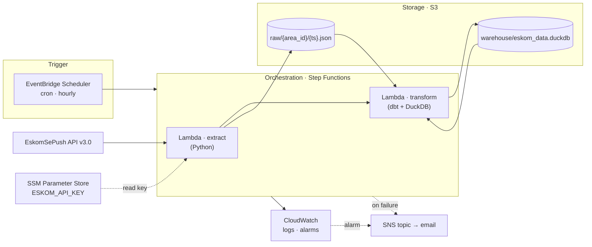
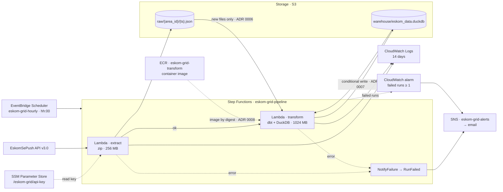
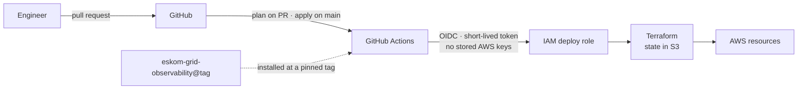

# Eskom Grid Cloud

Serverless, zero-cost AWS deployment of the [Eskom Grid Observability](https://github.com/Furnx/eskom-grid-observability) pipeline — infrastructure as code, deployed by CI, running around the clock without a laptop.

> **Status:** Phase 3 complete (2026-09-27): every hour a Step Functions state machine runs the extract Lambda (raw JSON into S3), then, only if it succeeded, the transform Lambda (dbt over the new files, updating the DuckDB warehouse in S3); any failure is emailed within seconds, with a CloudWatch alarm as backstop — all without the laptop. Phase 1 (2026-09-24) also proved a full destroy → rebuild → restore. Phase 4 (CI/CD) is next. Details in [docs/ROADMAP.md](docs/ROADMAP.md).

## The problem

[Eskom Grid Observability](https://github.com/Furnx/eskom-grid-observability) is a batch ELT pipeline: every hour it pulls loadshedding schedules for South African metros from the EskomSePush API, lands the raw JSON, and builds a dimensional model with dbt on DuckDB. Its value is the **history it accumulates** — and the local deployment only runs while a laptop is switched on.

| Weakness of the local deployment | Consequence |
|---|---|
| Runs inside Docker Desktop on a laptop | Every hour the laptop is off is a gap in the history |
| Raw landing zone and warehouse live on one disk, git-ignored | One disk failure erases everything collected |
| The API key lives in a `.env` file | A secret tied to a machine, not to an identity |
| Nothing watches the pipeline | Failures go unnoticed until someone looks |
| "The infrastructure" is a laptop | It cannot be rebuilt from code |

## The solution

Move the workload — its logic unchanged — onto managed, event-driven AWS services, provisioned entirely by Terraform, deployed by GitHub Actions, and kept inside the AWS Free Plan.

| Local component | Role | AWS replacement |
|---|---|---|
| Dagster `ScheduleDefinition` (cron) | Trigger | EventBridge Scheduler |
| Dagster job (extract → dbt build) | Orchestration | Step Functions |
| Docker container running the `@asset` code | Compute | Lambda |
| `data/raw/{area_id}/{ts}.json` | Raw landing zone | S3 |
| `data/eskom_data.duckdb` | Warehouse | DuckDB file in S3 |
| `.env` | Secrets | SSM Parameter Store |
| `context.log` + Dagster UI | Logs and alerts | CloudWatch + SNS |
| Docker Desktop | Infrastructure | Terraform |
| `docker compose up` | Deployment | GitHub Actions via OIDC |

Dagster remains the *local development* orchestrator. In production its job is done by the cloud's own scheduler and state machine — the reasoning is in [ADR 0002](docs/adr/0002-dagster-stays-local.md).

## Target architecture


```mermaid
flowchart LR
    API["EskomSePush API v3.0"]
    SSM["SSM Parameter Store<br/>ESKOM_API_KEY"]

    subgraph SCHED["Trigger"]
        EB["EventBridge Scheduler<br/>cron · hourly"]
    end

    subgraph SFN["Orchestration · Step Functions"]
        direction TB
        EXTRACT["Lambda · extract<br/>(Python)"]
        TRANSFORM["Lambda · transform<br/>(dbt + DuckDB)"]
        EXTRACT --> TRANSFORM
    end

    subgraph S3["Storage · S3"]
        RAW[("raw/{area_id}/{ts}.json")]
        WH[("warehouse/eskom_data.duckdb")]
    end

    SNS["SNS topic → email"]
    CW["CloudWatch<br/>logs · alarms"]

    EB --> SFN
    SSM -. read key .-> EXTRACT
    API --> EXTRACT
    EXTRACT --> RAW
    RAW --> TRANSFORM
    WH --> TRANSFORM
    TRANSFORM --> WH
    SFN -. on failure .-> SNS
    SFN --> CW
    CW -. alarm .-> SNS
```

Running today (end of Phase 3). One schedule starts one state machine, which
runs the two functions in order. Only failures of Lambda itself are retried
([ADR 0009](docs/adr/0009-retry-only-failures-around-a-function.md)); every
other failure is emailed by the failure branch, and an alarm backs it up
([ADR 0010](docs/adr/0010-failure-branch-and-backstop-alarm.md)):


```mermaid
flowchart LR
    API["EskomSePush API v3.0"]
    SSM["SSM Parameter Store<br/>/eskom-grid/api-key"]
    ECR["ECR · eskom-grid-transform<br/>container image"]
    EB["EventBridge Scheduler<br/>eskom-grid-hourly · hh:00"]

    subgraph SFN["Step Functions · eskom-grid-pipeline"]
        direction TB
        EXTRACT["Lambda · extract<br/>zip · 256 MB"]
        TRANSFORM["Lambda · transform<br/>dbt + DuckDB · 1024 MB"]
        NOTIFY["NotifyFailure → RunFailed"]
        EXTRACT -- ok --> TRANSFORM
        EXTRACT -. error .-> NOTIFY
        TRANSFORM -. error .-> NOTIFY
    end

    subgraph S3["Storage · S3"]
        RAW[("raw/{area_id}/{ts}.json")]
        WH[("warehouse/eskom_data.duckdb")]
    end

    SNS["SNS · eskom-grid-alerts<br/>→ email"]
    ALARM["CloudWatch alarm<br/>failed runs ≥ 1"]
    CW["CloudWatch Logs<br/>14 days"]

    EB --> SFN
    SSM -. read key .-> EXTRACT
    API --> EXTRACT
    EXTRACT --> RAW
    RAW -- "new files only · ADR 0006" --> TRANSFORM
    WH --> TRANSFORM
    TRANSFORM -- "conditional write · ADR 0007" --> WH
    ECR -. image by digest · ADR 0008 .-> TRANSFORM
    NOTIFY --> SNS
    SFN -. failed runs .-> ALARM
    ALARM --> SNS
    EXTRACT --> CW
    TRANSFORM --> CW
```

Delivery path (Phase 4):


```mermaid
flowchart LR
    DEV["Engineer"] -- "pull request" --> GH["GitHub"]
    GH -- "plan on PR · apply on main" --> GA["GitHub Actions"]
    GA -- "OIDC · short-lived token<br/>no stored AWS keys" --> ROLE["IAM deploy role"]
    ROLE --> TF["Terraform<br/>state in S3"]
    TF --> AWS["AWS resources"]
    APP["eskom-grid-observability@tag"] -. "installed at a pinned tag" .-> GA
```

Every workload identity is least-privilege: the extract function may only read one parameter and write into `raw/`; the transform function may read `raw/` and read/write `warehouse/`; the state machine may only invoke those two functions and publish to the alert topic, and only this state machine may assume its role; the scheduler may only start the state machine.

## How the two repositories relate

- **[eskom-grid-observability](https://github.com/Furnx/eskom-grid-observability)** — the *application*: extraction logic, dbt models and tests, and the Dagster definitions used for local development.
- **eskom-grid-cloud** (this repository) — the *platform*: Terraform, Lambda entry points, CI/CD, monitoring, and the decisions behind them.

The platform installs the application at a **pinned git tag**, so every deployment is versioned and the two repositories evolve independently. No pipeline logic lives here.

## Cost

Designed for **R0**. The account is on the AWS Free Plan (credits, cannot be charged) and the design uses only services with always-free allowances wherever one exists — see [ADR 0003](docs/adr/0003-zero-cost-constraints.md).

Hourly cadence, two areas. Lambda and ECR figures are measured from the first
days of Phase 2 (2026-09-26): an extract run bills about 0.8 GB-s, a transform
run about 12 GB-s (1 GB for ~11–12 s, peaking near 400 MB). Step Functions is
an early reading from the Free Tier page (44 transitions in the first day of
Phase 3, 2–3 per run); the rest are estimates. Phase 5 replaces them with a
month of measured usage. Prices are af-south-1's, from the AWS Price List API.

| Service | Monthly usage | Always-free allowance | Note |
|---|---|---|---|
| Lambda | 1,440 invocations · ~9,000 GB-s (measured) | 1M invocations · 400,000 GB-s | always free · ~2% of the compute allowance |
| Step Functions (Standard) | 720 runs · ~1,500–2,200 state transitions | 4,000 | always free — 4 states, retries only on Lambda faults (ADR 0003, 0009) |
| EventBridge Scheduler | 720 invocations (one schedule) | 14M | always free |
| SSM Parameter Store | 1 standard parameter | standard parameters free | always free |
| SNS | < 10 emails (2 per failed run) | 1,000 emails | always free |
| CloudWatch | < 100 MB logs · 1 alarm | 5 GB logs · 10 alarms | always free |
| S3 | ~0.2 GB (mostly 3 days of old warehouse versions) · ~2,900 PUT/LIST · ~6,500 GET | none on the Free Plan | ≈ $0.03 — credits |
| ECR | 3 images × ~265 MB ≈ 0.8 GB (measured) | none on the Free Plan | ≈ $0.08 ($0.10/GB-month) — credits |

Estimated steady state on a paid plan after the Free Plan window (~March 2027): **about $0.10 per month**, almost all of it ECR storage and S3 requests.

## Deploy / destroy

Prerequisites: AWS CLI v2 with the `eskom-admin` profile, Terraform >= 1.6,
Python 3.13 with `pip`, Docker Desktop (the transform image is built locally
for arm64), an EskomSePush API key, and an email address for failure alerts.

### One-time: the bootstrap (where Terraform keeps its state)

Terraform's state, its record of everything it manages, lives in an S3 bucket
([ADR 0011](docs/adr/0011-state-in-s3-and-a-bootstrap-configuration.md)). That
bucket is created by a small separate configuration, `infra/bootstrap/`, which
is only ever applied from the laptop and keeps its own state in the bucket it
creates. So the very first apply in an account starts on a local state and
moves it in afterwards:

```powershell
cd infra/bootstrap
Set-Content backend_override.tf 'terraform {', '  backend "local" {}', '}'
terraform init
terraform apply                 # the state bucket and its settings
Remove-Item backend_override.tf
terraform init -migrate-state   # answer yes: the state moves into the bucket
cd ../..
```

The bucket is protected against `destroy`, and its name (with the account ID)
is written into both configurations' `backend` blocks, which can't use
variables. In another account, change both.

### One-time: store the API key

The key is kept in SSM Parameter Store and is deliberately **not** managed by
Terraform, so its value never enters the configuration or the state file.
Create it once:

```powershell
aws ssm put-parameter `
  --name "/eskom-grid/api-key" `
  --type SecureString `
  --value "<your EskomSePush key>" `
  --profile eskom-admin --region af-south-1
```

`terraform destroy` does not remove it, so this step is not repeated.

### One-time: the alert address

Failures are emailed to one address
([ADR 0010](docs/adr/0010-failure-branch-and-backstop-alarm.md)). It is a
required Terraform variable, kept out of the repository in
`infra/terraform.tfvars`, which git ignores:

```hcl
alert_email = "you@example.com"
```

### Deploy

```powershell
# 0. First deployment only. Two things must exist before the rest:
#    - the ECR repository: the transform's image must be pushed into it before
#      the function can be created;
#    - the alert topic and subscription: the state machine's definition names
#      the topic, and AWS must confirm your address before it delivers anything.
#    Create just those first. The quotes matter in PowerShell, which otherwise
#    splits each argument at the dot. init names the laptop's profile for the
#    S3 backend; it's needed once per clone.
cd infra
terraform init -backend-config="profile=eskom-admin"
terraform apply "-target=aws_ecr_repository.transform" "-target=aws_sns_topic_subscription.alert_email"
cd ..
#    Then click the link in the "AWS Notification - Subscription Confirmation"
#    email. Until you do, alerts go nowhere.

# 1. Build the extract Lambda package from the pinned application tag
#    (app_version in infra/variables.tf). archive_file is read at plan time,
#    so this must come first; the plan also refuses a build made from a
#    different version.
./scripts/build_lambda.ps1

# 2. Build, smoke-test and push the transform image (ADR 0008). The smoke tests
#    run a real dbt build offline, on a read-only disk, without /dev/shm, as in
#    Lambda. Only committed code is pushed; the pushed tag is recorded in
#    build/ for the plan, which deploys it by digest. About 2 minutes from
#    Docker's cache, 10-15 after an application change.
./scripts/build_transform_image.ps1 -Push

# 3. Review and apply. Avoid hh:00 to hh:01, while the hourly run is going:
#    a run that starts mid-deploy gets the old code.
cd infra
terraform plan      # read this before applying
terraform apply
```

`terraform apply` prints the bucket, both functions and their log groups, the
schedule, the state machine, the alert topic, the ECR repository and a set of
copy-paste verification commands.

### Verify

```powershell
# Is it healthy? The schedule, the latest runs, the alarm and the alert
# subscription, then one verdict: HEALTHY, FAILING, STALE or NOT RUNNING.
# Read-only; it is also how to tell a failure has been fixed, since a
# successful run sends no email.
./scripts/check_pipeline.ps1

# Run the whole pipeline once, as the schedule does (costs 2 of the 50 daily
# EskomSePush requests). Check first that no run is in progress:
aws stepfunctions list-executions --state-machine-arn arn:aws:states:af-south-1:<account-id>:stateMachine:eskom-grid-pipeline `
  --status-filter RUNNING --query "executions[].name" --output text --profile eskom-admin --region af-south-1
aws stepfunctions start-execution --state-machine-arn arn:aws:states:af-south-1:<account-id>:stateMachine:eskom-grid-pipeline `
  --profile eskom-admin --region af-south-1

# One object per area, all sharing a run timestamp
aws s3 ls s3://eskom-grid-<account-id>/raw/ --recursive --profile eskom-admin

# Logs
aws logs tail /aws/lambda/eskom-grid-extract --since 15m `
  --profile eskom-admin --region af-south-1

# Run only the transform (no API cost). This bypasses the state machine: no
# retries, no alert. Without --cli-read-timeout the CLI gives up after 60 s and
# invokes the function a second time.
aws lambda invoke --function-name eskom-grid-transform --cli-read-timeout 310 `
  --profile eskom-admin --region af-south-1 response.json; cat response.json

# The warehouse it replaced, and its logs
aws s3api head-object --bucket eskom-grid-<account-id> --key warehouse/eskom_data.duckdb `
  --profile eskom-admin --region af-south-1
aws logs tail /aws/lambda/eskom-grid-transform --since 15m `
  --profile eskom-admin --region af-south-1
```

### Look at the warehouse

The warehouse is a single DuckDB file in S3. To query it, the script below
downloads the current version into a temporary folder, opens it read-only in
the DuckDB command-line tool (`winget install DuckDB.cli`), and deletes the
copy when you quit. It never uploads: the transform function owns that object.

```powershell
# Explore interactively: SQL ending in ';', .tables to list tables, .quit to leave
./scripts/look_at_warehouse.ps1

# Or ask one question and exit (text values in single quotes)
./scripts/look_at_warehouse.ps1 -Query "SELECT count(*) AS runs FROM fct_pipeline_runs"

# Keep the copy, e.g. to practise offline
./scripts/look_at_warehouse.ps1 -KeepCopyIn "$HOME\eskom-grid-practice"
```

`fct_pipeline_runs` has one row per extraction run (a new row every hour);
times are stored in UTC, so add `INTERVAL 2 HOUR` for SAST.

### Destroy

`terraform destroy` removes infrastructure, never history
([ADR 0005](docs/adr/0005-raw-history-outlives-infrastructure.md)). The raw
bucket holds the only copy of data the API cannot return again, so S3's refusal
to delete a bucket that still holds data is kept as a safety catch.

**A plain `terraform destroy`** removes the schedule, the state machine, the
functions, roles and log groups, the alert topic, subscription and alarm, and
the ECR repository *with its images* (they are rebuilt from git,
[ADR 0008](docs/adr/0008-transform-image-deployed-by-digest.md)), then stops
with `BucketNotEmpty`. The history is intact, but the bucket
has lost its public access block, lifecycle rule and versioning;
`terraform apply` restores them along with everything else.

**A full teardown, history included**, is two deliberate steps. Start just
after a scheduled run (around hh:02), so that no new object lands between them:

```powershell
# 1. Back up, verify, then delete every object version. The script downloads
#    the bucket into -BackupPath (a new folder, outside the repository), checks
#    every file against S3's MD5 fingerprint, and only then asks for the bucket
#    name. The bucket is versioned, so `aws s3 rm` would only add delete markers.
#    Add -DryRun to do everything except the deletion.
./scripts/purge_bucket.ps1 -Bucket eskom-grid-<account-id> -BackupPath "$HOME\eskom-grid-backup\<date>"

# 2. Remove the infrastructure.
cd infra
terraform destroy
```

Left in place on purpose: the SSM parameter holding the API key (created
outside Terraform), the bootstrap and its state bucket (which still holds the
now-empty state of the destroyed configuration), `infra/terraform.tfvars`, and
your local backup.

### Rebuild and restore

```powershell
# The same order as a first deployment: repository and alert subscription,
# image, everything else. Confirm the subscription again when AWS emails you:
# a rebuilt topic is a new topic.
cd infra
terraform apply "-target=aws_ecr_repository.transform" "-target=aws_sns_topic_subscription.alert_email"
cd ..
./scripts/build_lambda.ps1
./scripts/build_transform_image.ps1 -Push
cd infra
terraform apply
cd ..

$backup = "$HOME\eskom-grid-backup\<date>"
aws s3 sync "$backup\objects" s3://eskom-grid-<account-id>/ --profile eskom-admin

# Prove the restore is byte-identical: no output means every object matches.
aws s3api list-objects-v2 --bucket eskom-grid-<account-id> --query "Contents[].[Key, ETag, Size]" `
  --output text --profile eskom-admin | Sort-Object | Set-Content "$backup\restored.tsv"
Compare-Object (Get-Content "$backup\fingerprints.tsv") (Get-Content "$backup\restored.tsv")
```

If `apply` fails on the bucket with `OperationAborted`, S3 has not yet released
the name of the bucket that was just deleted: wait a few minutes and run
`terraform apply` again. Restored objects keep their keys, and the run
timestamp is part of the key, so the history continues where it stopped. A
scheduled run that lands before the comparison shows up as extra `=>` lines.
The backup includes the warehouse, so the transform carries on from it; a
transform run that fires before the restore is harmless, because the warehouse
is derived entirely from `raw/`.

### API quota

The EskomSePush free tier allows 50 requests per day. This deployment uses one
request per area per run: two areas, hourly, is 48 per day, so there is room
for one extra run a day (a manual `start-execution`). A failed extract is
therefore never retried: it is emailed, and the next hour is the retry
([ADR 0009](docs/adr/0009-retry-only-failures-around-a-function.md)). **Keep the local
Dagster schedule switched off while the cloud deployment is running** - both
together would exceed the quota and the extraction would start failing with
HTTP 429.

## Decisions

Architecture Decision Records live in [docs/adr/](docs/adr/README.md). Start with [0001](docs/adr/0001-serverless-over-always-on-vm.md) (why serverless), [0002](docs/adr/0002-dagster-stays-local.md) (why Dagster stays local) and [0003](docs/adr/0003-zero-cost-constraints.md) (the zero-cost rules).

## Repository layout

Planned; directories appear in the phase that fills them.

```
eskom-grid-cloud/
├── README.md
├── CLAUDE.md                 project context for AI-assisted sessions
├── docs/
│   ├── ROADMAP.md            phases, milestones, status
│   └── adr/                  architecture decision records
├── infra/                    Terraform — one file per concern        (Phase 1–3)
├── functions/                thin Lambda entry points:               (Phase 1–2)
│   ├── extract/              handler.py, shipped as a zip
│   └── transform/            handler.py + Dockerfile, shipped as an image
├── .github/workflows/        plan on PR, apply on main               (Phase 4)
└── scripts/                  build (zip, image + push), purge, look at the warehouse,
                              check pipeline health; smoke test       (Phase 1–3, 5)
```
WTC-PQ6WCN86